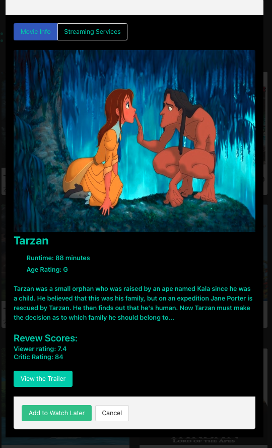

# Movie Buff - Find Your Favourite Movies

## Description

This application is intended for lovers of film who want to learn more about their favourite movies and where they can watch them. Powered by the TMDB API, Watchmode API, News API, and featuring styling from the Bulma CSS framework, this app is designed as a one-stop-shop for all things movie and film-related media. 

The deployed application may be accessed [here](https://renjithkumar993.github.io/MovieBuff/).

## Screenshots

## Installation

As a browser-based application, no installation is required to use this app. This application has been tested across several popular modern browsers, including Google Chrome, Apple Safari, Mozilla Firefox, Microsoft Edge, and Opera. However, as this application was tested throughout development using Google Chrome and with that browser in mind, this is where users will likely have the best experience. 

## Usage

This application is open-source and free for use. Those wishing to access the application may follow the deployment link available above or by accessing the link available in this project's Git repo. Alternatively, users may clone the repo and open the index.html file in their browser using the files cloned to their local system.

When new users arrive to the landing page they are met with carousels featuring movies that are 'Trending Today' and 'Currently on Air.' If users are interested, they can click on these film posters for more information. This can be a useful resource for those searching without any particular film in mind. The landing page also features buttons that will reveal upcoming movie trailers and movie news. 

Alternatively, users who have a specific film in mind, may search by title using the main search bar, to then be returned a series of cards. These cards feature the posters, titles, and release date of movies that feature titles similar to those specified in the user's search terms. Users can select from amongst these cards and click on each to bring up a modal that provides further information, including the movie's runtime, plot summary, user and critic scores, and also a link to where they may view the trailer. Users can then switch tabs to explore where films are available for streaming as well as save movies that they are interested in to their watch later list. Users' searched movies are automatically saved to their search history, taking advantage of their browser's local storage, and may be viewed by clicking the 'View Search History' button. This button reveals a tab with buttons that users can click on to resume their previous searches.

*Note: In its beta phase, the news API is only available when the user clones the Git repository and launches the application through their local environment. The News API does not allow requests from the browser on its developer plan and only accepts requests from the local host. Users can view this content by launching the application with their local server using "localhost" in the web address (URL) to indicate that the server is running on the same machine that they are using.

## Roadmap

This project if far from complete! There is still considerable room to expand it further and implement new and exciting features. 

Planned improvements include: 
1. Further additions to the watch later functionality to allow users to better track the films that they are interested in as well as new/upcoming films.
2. Additional development on movie recommendations that are similar to the movies that users search. This feature was implemented previously but removed due to using too many API calls. 
3. Integration of other movie-centric API (e.g,. the IMDB API)to provide user's with even more information, including information about movie awards, box office metrics, cast info, and film credits.

Please visit the open issues for a full list of proposed features and known issues.

## Contributing

Contributions from users like you can help make this application even more special and support a development environment that is a great space for both new and experienced developers to learn, inspire, and create. Any contributions you make are greatly appreciated.

For those with suggestions on how to improve our application,
please fork the repo and create a pull request. Then you can create an issue with the tag "enhancement" or another label to let us know the nature of the suggestion.

To contribute please follow these steps:

1. Fork the Project
2. Create your Feature Branch (git checkout -b feature/AmazingFeature)
3. Commit your Changes (git commit -m 'Add some AmazingFeature')
4. Push to the Branch (git push origin feature/AmazingFeature)
5. Open a Pull Request

Any and all contributions are greatly appreciated!

## Credits

Thanks go out to the UNB College of Extended Learning and their Full-Stack Web-Development bootcamp, including their exceptional teaching staff and student support services, for making this project possible. 

## License 

Please refer to the LICENSE in the repo.
